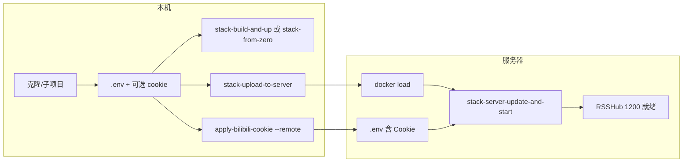

# RSS + Clash 栈部署计划

本文档为**操作顺序与检查点**的简明清单，完整说明见 [DEPLOYMENT-STACK.md](../DEPLOYMENT-STACK.md)。

---

## 一、本地部署（开发/测试）

| 步骤 | 操作 | 说明 |
|------|------|------|
| 1 | `git clone --recurse-submodules <rss-repo-url>` 或 `git submodule update --init --recursive` | 含 RSSHub、clash-aio 子项目 |
| 2 | `cp .env.stack.example .env`，填写 **RAW_SUB_URL**（必填） | 可选：RSSHUB_PATH、CLASH_AIO_PATH、BUILD_PROXY |
| 3 | （可选）B 站 Cookie：将 Cookie 存于 `cookie/bilibili_cookies.py` 或 `cookie/bilibili.txt`，执行 `./scripts/apply-bilibili-cookie.sh --uid <uid>` | 合并到 .env 并重启 rsshub；详见 [bilibili-cookie-docker.md](bilibili-cookie-docker.md) |
| 4 | `./scripts/stack-build-and-up.sh` | 一键构建并启动；若需从零完整验证用 `./scripts/stack-from-zero.sh` |
| 5 | 验证：浏览器打开 `http://127.0.0.1:1200/`，或 `./scripts/stack-verify.sh` | 1200 就绪即 RSSHub 可用 |

**检查点**：`.env` 存在且 RAW_SUB_URL 已填；需 B 站登录态路由时已执行 `apply-bilibili-cookie.sh` 或手动配置 `BILIBILI_COOKIE_<uid>`。

---

## 二、远程服务器部署（镜像在本机构建后上传）

与 [stack-upload-to-server.sh](../scripts/stack-upload-to-server.sh) 及 [DEPLOYMENT-STACK.md 六、离线/无 Docker Hub 环境](../DEPLOYMENT-STACK.md#六离线无-docker-hub-环境与构建失败时的备选流程) 对应。

### 2.1 本机

| 步骤 | 操作 | 说明 |
|------|------|------|
| 1 | 在 rss 根目录已配置 `.env`、子项目已初始化 | 同「一、本地部署」步骤 1～2 |
| 2 | （可选）Cookie：维护 `cookie/` 目录，便于后续 `--remote` 推送 | 见 [bilibili-cookie-docker.md](bilibili-cookie-docker.md) |
| 3 | `./scripts/stack-upload-to-server.sh` | 打包栈镜像 → scp 到服务器 → ssh 在服务器上 mv + `docker load`；可设 `SKIP_PACK=1` 仅上传已有 tar |
| 4 | （可选）`./scripts/apply-bilibili-cookie.sh --uid <uid> --remote` | 将 Cookie 合并到**服务器** `.env` 并重启 rsshub；环境变量 REMOTE_USER、REMOTE_HOST、REMOTE_ALCHEMY_DIR 与上传脚本一致 |

### 2.2 服务器

| 步骤 | 操作 | 说明 |
|------|------|------|
| 1 | 确认 Docker 权限（如 `docker ps` 无报错） | 若无，管理员执行 `usermod -aG docker <用户>` 后重新登录 |
| 2 | 进入 rss 项目目录（如 `REMOTE_ALCHEMY_DIR`） | 与上传脚本目标目录一致 |
| 3 | 若本机已执行 `apply-bilibili-cookie.sh --remote`，则 .env 已含 Cookie；否则按需编辑 `.env` 添加 `BILIBILI_COOKIE_<uid>=...` | 见 [bilibili-cookie-docker.md](bilibili-cookie-docker.md) |
| 4 | `./scripts/stack-server-update-and-start.sh` | 检查权限 → 加载镜像 tar（若存在）→ 停止旧容器 → 启动栈 |
| 5 | 验证：`curl -s http://127.0.0.1:1200/` 或 `./scripts/stack-server-check.sh` | 1200、25501、出网正常即部署完成 |

**检查点**：镜像 tar 已上传并在服务器完成 `docker load`；服务器上 `.env` 已就绪（含 RAW_SUB_URL 及可选 Cookie）；栈由 `stack-server-update-and-start.sh` 或 `stack-build-and-up.sh` 启动。

---

## 三、部署流程概览

- **仅本地**：A → B → C。
- **本机构建、服务器运行**：本机 A → B → D（+ 可选 E）；服务器 F → G（若未用 E 则手动编辑 .env）→ H → I。

---

## 四、Cookie 配置小结

| 场景 | 做法 |
|------|------|
| 本地、Cookie 在 `cookie/` 目录 | `./scripts/apply-bilibili-cookie.sh --uid <uid>`（默认合并到本地 .env 并重启 rsshub） |
| 本地、仅合并不重启 | `./scripts/apply-bilibili-cookie.sh --uid <uid> --no-restart` |
| 远程、Cookie 在本机 `cookie/` 目录 | `./scripts/apply-bilibili-cookie.sh --uid <uid> --remote`（scp 片段到服务器、合并 .env、ssh 重启 rsshub） |
| 远程、手动 | 登录服务器 → 编辑 `REMOTE_ALCHEMY_DIR/.env` 添加 `BILIBILI_COOKIE_<uid>=...` → `docker compose -f docker-compose.stack.yml up -d rsshub` |

环境变量 `REMOTE_USER`、`REMOTE_HOST`、`REMOTE_ALCHEMY_DIR` 与 [stack-upload-to-server.sh](../scripts/stack-upload-to-server.sh) 一致（默认 `REMOTE_ALCHEMY_DIR=/home/alchemy/RSS`）。
